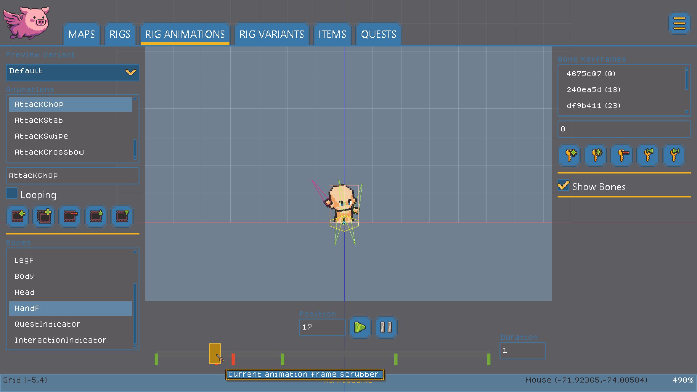
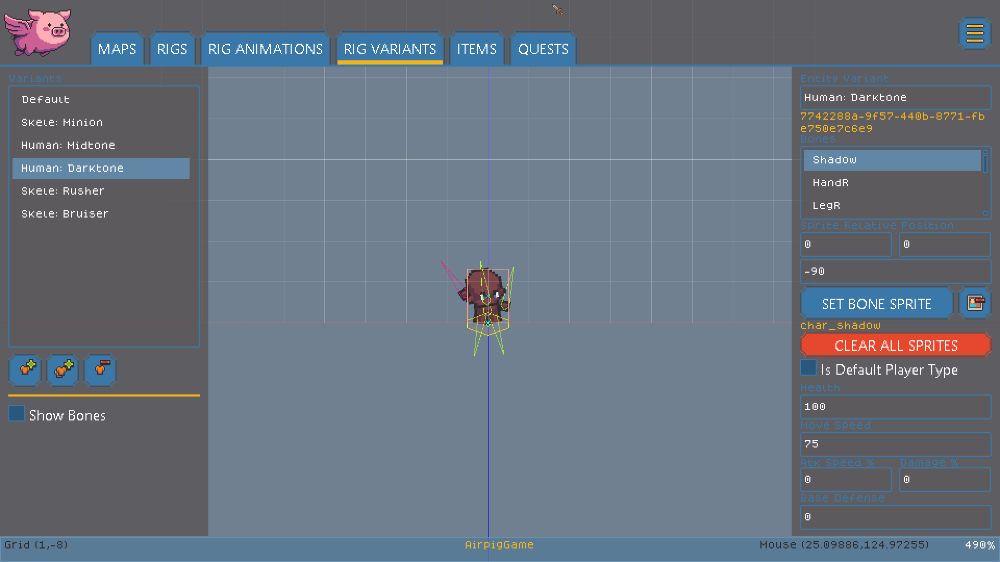
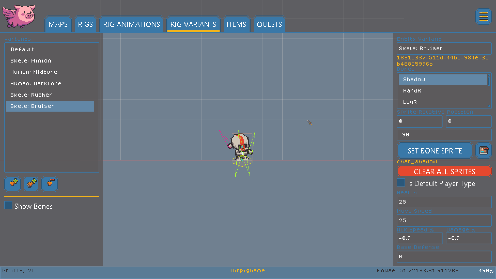
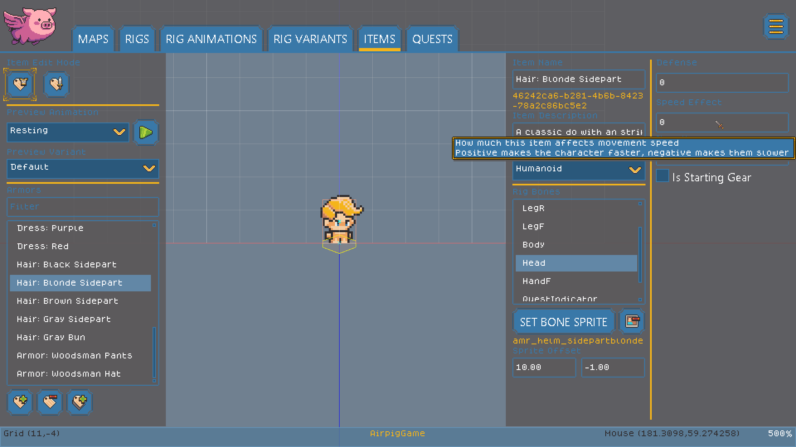
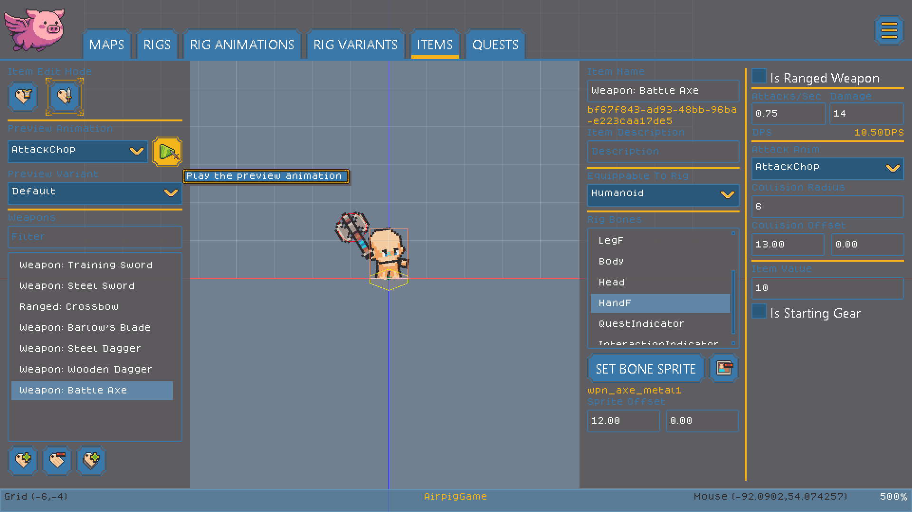
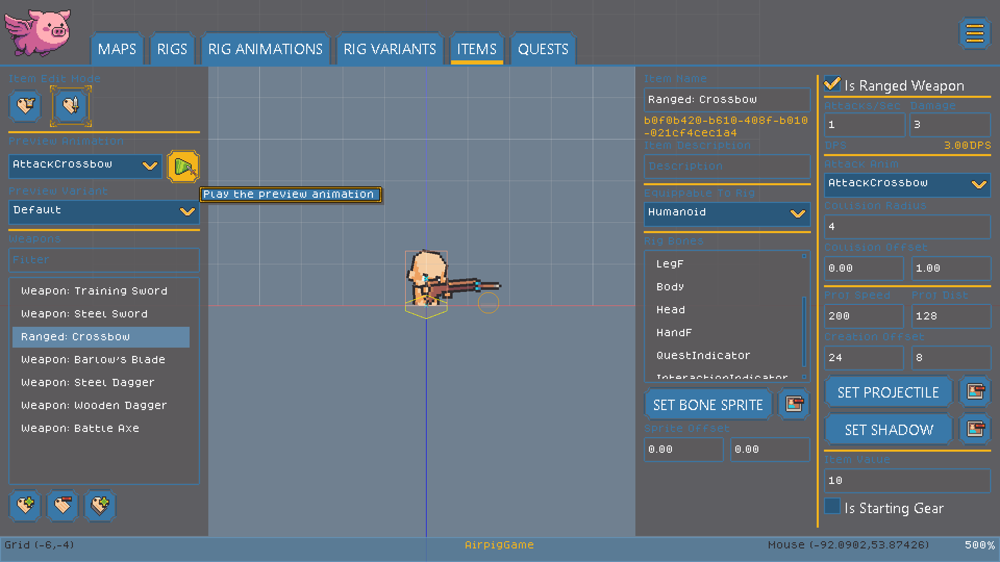
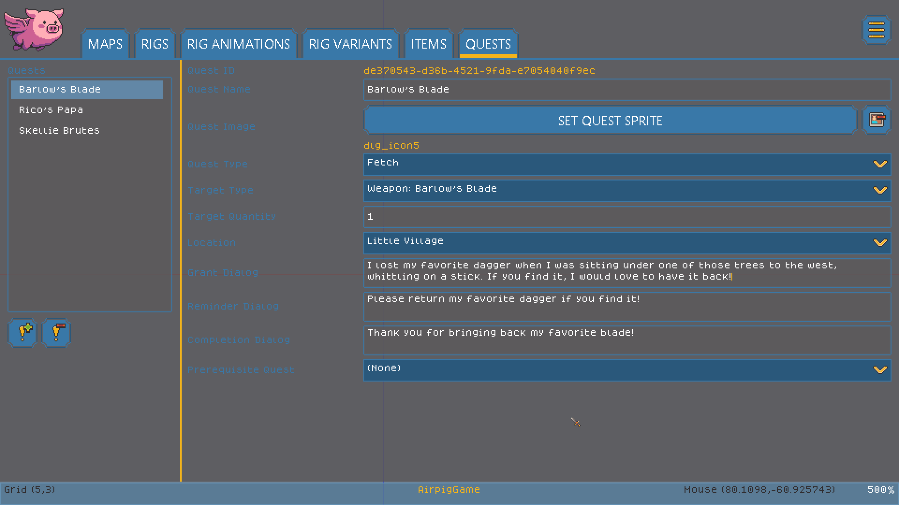
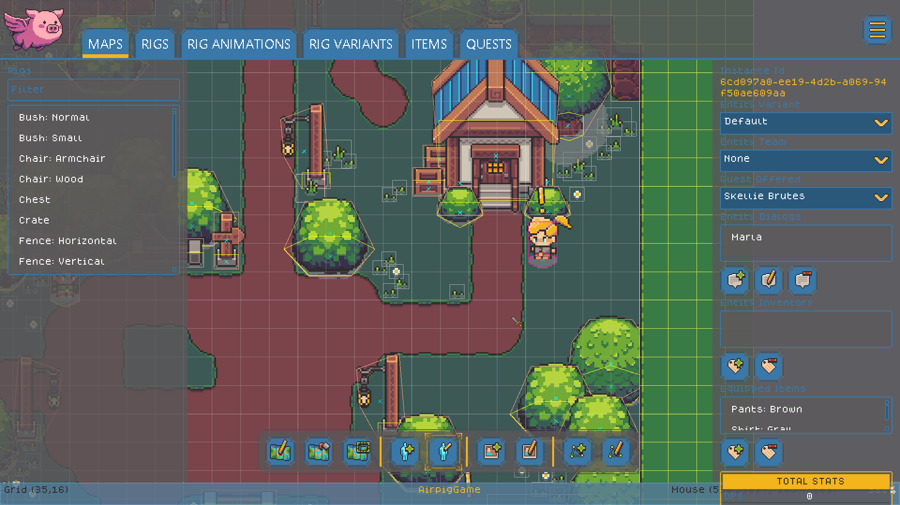

# AirPig Game Engine

AirPig is a niche game engine focused on building pixel art Action Role Playing Games with sprite rigging animation.

AirPig allows artists and game designers to rapidly build and playtest ARPGs with no code! It features built-in tools to create maps, entities, quests, dialog, items, and more without leaving the engine or paying for expensive third-party licenses.

The AirPig editor is accessible for new game developers, fast for game-jammers, but offers powerful features and a fast engine that was purpose-built for pixely ARPGs.

[To learn more about AirPig, check out our YouTube channel.](https://www.youtube.com/@airpig-engine)


All of the UI controls in the AirPig engine should have tooltips! You can hover over a button, text field, or other UI control in the editor to get a brief description of what it does.


### Key Concepts

AirPig organizes the game development process into the following key concepts.

#### Rig

AirPig uses [2D Skeleton Animation](https://en.wikipedia.org/wiki/Skeletal_animation). The main gameplay object in AirPig is the Rig - which is a skeleton made up of bones with attached sprites. The bones can be positioned at keyframes to create animations. This type of animation is extremely efficient because you can reuse animations with different sprites to create a lot more variety than hand editing every frame.

Rigs in AirPig have a Behavior such as Character, Container or Prop. This dictates how the object behaves during gameplay. Characters can be on a Team, such as Player or Monster, offer quests, move around, and attack. Containers can hold items. Props are collidable gameplay objects.

Rigs and Behaviors give creators a simple but powerful set of tools for creating rich game entities!

<figure><figcaption>
A rig is a collection of bones with attached sprites. Rigs are animated by positioning bones at keyframes.
</figcaption></figure>

#### Variants

Variants are variations of a Rig that have unique properties. Variants allow you to create a class of character, such as "humanoid" and have a lot of unique variations such as human, skeleton, goblin, etc.

<figure><figcaption>
The "Darktone" variant in this screenshot has different skintone sprites but has all of the same properties and animations.
</figcaption></figure>

Not only do Variants allow you to reskin the skeleton with different sprites, they also allow you to set things like attack, defense, and movement modifiers. This allows artists to quickly create a lot of unique characters and creatures without re-animating sprites. It also allows game designers to quickly create and playtest different monster properties.

<figure><figcaption>
The "Skele:Bruiser" Variant has unique sprites but also defines custom Health, Movement, Attack, and Damage modifiers.
</figcaption></figure>

#### Items

AirPig's item editor allows game designers to define the weapons and armor that can be attached to Rigs in the game.

Armor items aren't limited to actual armor. You can use armor to create hair, clothing, or special effects too! Armor can provide defense and can also modify the wearer's movement speed.

<figure><figcaption>
This "Armor" item is actually blonde hair, which can be attached to a character's head to customize their look!
</figcaption></figure>

Weapon items can specify the collision size, which part of the weapon can deal damage, and which animation should be used for the weapon's attack. Weapons also specify properties such as the animation speed, and damage per hit.

<figure><figcaption>
Weapon items can specify an attack animation, attack speed and damage, and other properties.
</figcaption></figure>

Weapons aren't limited to melee weapons. Ranged weapons can specify additional unique properties that control what type of projectile they fire and how fast it can fly.

<figure><figcaption>
Ranged weapons can specify many additional properties that determine how fast and far the projectile flies.
</figcaption></figure>

#### Quests and Dialog

AirPig allows game designers to create Quests that can be offered by NPC characters. Quests can have a variety of types and can target specific types of enemy, item, or area. Quests can also specify other quests as prerequisits that must be completed, allowing editors to create more complex quest chains.

<figure><figcaption>
The quest editor allows game designers to design quests that can be offered by NPCs.
</figcaption></figure>

#### Maps

Maps are where everything comes together. Maps allow editors to rapidly draw out map geometry and add entities, sprites, and special Polygons such as collision or spawn areas to the map.

<figure><figcaption></figcaption></figure>

### Summary

This is just a brief overview of how AirPig allows game developers to rapidly create and test their ideas! AirPig is currently in Alpha and only available to close testers. Keep an eye on this page to learn how to get access as soon as a test build is available.
