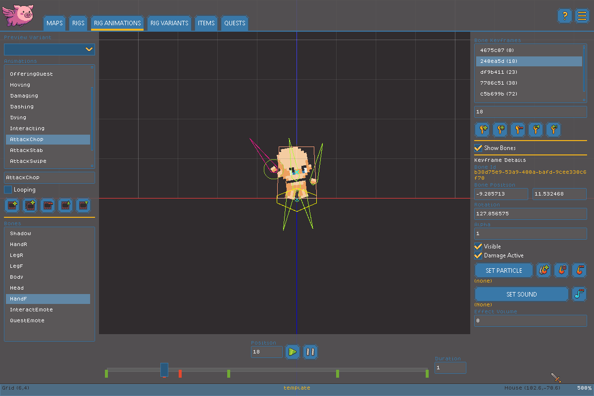

# Animation Editor

The Animation Editor is where you bring a Rig to life by posing its Bones at different points in time. See the [Glossary](glossary.md) for a refresher on Animations, Keyframes, and Bones if these are new concepts to you.

Every animation's timeline runs from **0 to 100**, representing your progress through the animation as a percentage rather than a fixed frame count - so an animation always plays at the same relative pace no matter how long or short you make it.


Animation Deep Dive


### Managing Animations

<figure><figcaption></figcaption></figure>

The Animation list shows every Animation defined on the current Rig. From here you can:

* **Add** a new, empty Animation.
* **Duplicate** the selected Animation, including all of its Keyframes.
* **Delete** the selected Animation, with a confirmation prompt. If the Animation is required by the Rig's current Behavior (see [Rig Editor](rig-editor.md)), you'll get an extra warning that deleting it may break gameplay.
* **Move Up / Move Down** to reorder Animations in the list.

Once an Animation is selected, you can rename it and toggle **Loops** to control whether it repeats automatically when it finishes playing.

### Previewing an Animation

* **Play** restarts the selected Animation from the beginning and plays it back.
* **Pause** stops playback wherever it currently is.
* The **scrubber** shows your current position in the timeline (0-100) alongside markers for every Keyframe, and can be dragged to move the playhead directly.
* **Duration** sets how long, in seconds, the Animation takes to play through once.
* The **Variant** dropdown lets you preview the Animation using a different Variant's sprites, without changing which Variant is actually selected elsewhere.
* **Show Bones** toggles a bone overlay while you work; it doesn't affect the published game.

### Working with Keyframes

The Bone list on this page lets you pick which Bone you're currently posing - selecting a Bone here also selects it for keyframing purposes. Once a Bone is selected, the Keyframe list shows every Keyframe that exists for it in the current Animation:

* **Add** creates a new Keyframe for the selected Bone at the current position, copying that Bone's current pose as a starting point.
* **Key All Bones** does the same thing for every Bone on the Rig at once, skipping any Bone that already has a Keyframe at the current position.
* **Delete** removes the selected Keyframe, with a confirmation prompt.
* **Prev / Next** jump the playhead between existing Keyframes for the selected Bone.
* You can also type a specific position (0-100) directly into the time field to move a selected Keyframe.

### Editing a Keyframe's Pose

With a Keyframe selected, its properties become editable:

* **Position (X/Y)**, **Rotation**, and **Alpha** (transparency) - the Bone's pose at this exact point in the Animation. AirPig smoothly blends between Keyframes, so you only need to set poses at the moments that matter.
* **Visible** - whether the Bone (and its sprite) is shown at all at this Keyframe. Useful for making something appear or disappear partway through an Animation.
* **Damage Active** - marks whether this Keyframe is part of an active attack window, for Animations tied to a Weapon's attack.
* **Sound** - attach a sound effect that plays when the timeline reaches this Keyframe, with volume control. Use the clear button to remove it.
* **Particle Effect** - attach a particle effect that triggers at this Keyframe. Use the clear button to remove it.
