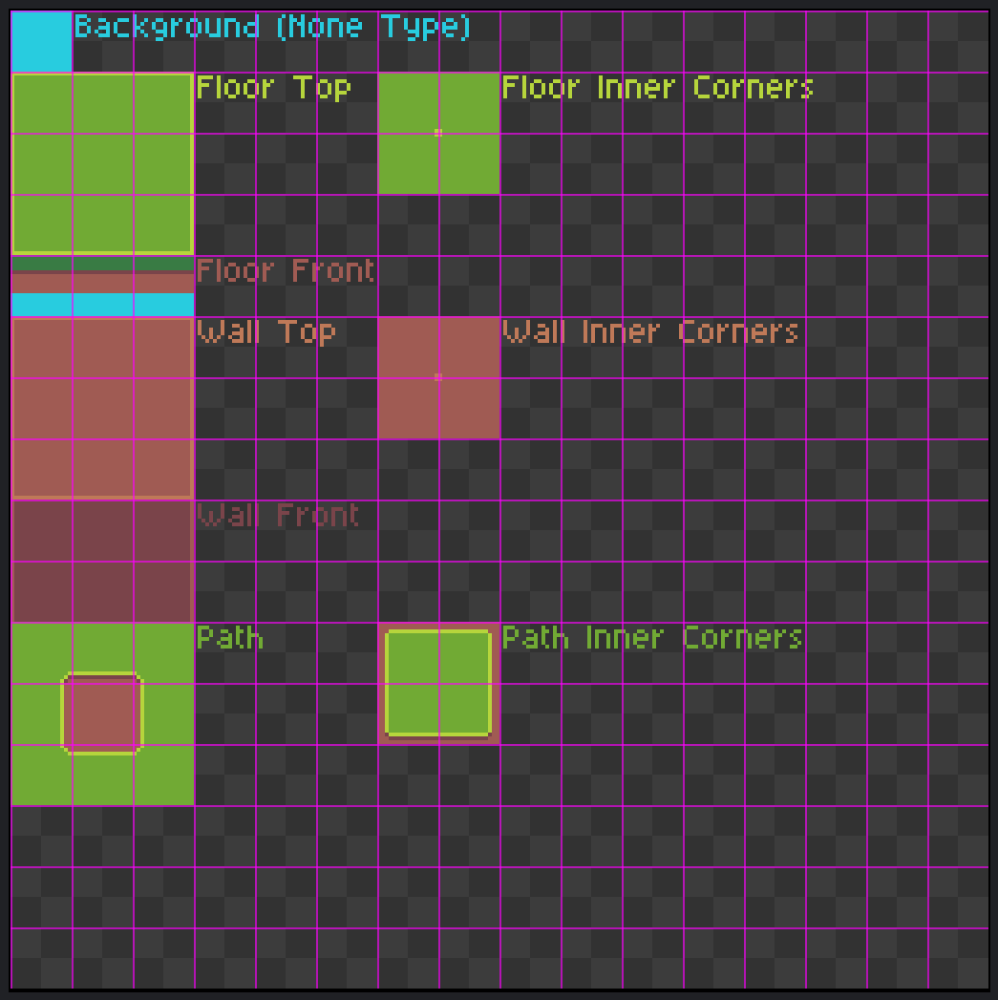

# Creating Raw Content

Most of the game development and game content creation happens within the AirPig editor experience. Content created by AirPig itself are often referred to as "assets" in documentation and the engine. However, "raw" assets such as sprites, sounds, and music, are authored in programs such as PhotoShop or Aseprite.

When a new project is created in AirPig, it will automatically create a folder structure on disk for the content types described below.

Sites such as [Itch.io have a large volume of game asset packs available](https://itch.io/game-assets/tag-pixel-art) that are affordable and fairly simple to use in AirPig with light editing. This is a great way for new game developers to start their journey!


AirPig regularly scans the game folder for new content but may not immediately pick up new content when added to folders outside of AirPig. You can click "Rescan Assets" from the editor menu at any time to pick up newly-added items including both raw content and assets such as rigs that were copied from another project!


### root

The root project directory should contain a `.pig` file that is your main project file loaded by AirPig to load and edit a game project. It will also include files that store item and quest data. Raw content assets should not be placed in the project root folder.

### biomes

The engine will look for "biome" files in the `biomes` folder.

An AirPig "biome" is a tileset used by a map to define the look of a map. There is a 1:1 relationship between map and biome - meaning each map can only have a single biome defined. A biome is a 256x256 pixel png file that has a specific layout. The game engine uses this layout to resolve the tiles based on the tile type defined on the map (Background, Floor, Path, Walls).

All tiles in AirPig are 16x16 pixels.

This means that you can "hot swap" the biome used by a map without redrawing any tiles or map geometry. This also allows you to duplicate a map and change the biome, reusing a map layout while changing the look of the map.

Each png placed in the `biomes` folder is expected to be a 256x256 pixel png file with the following layout:

<figure><figcaption></figcaption></figure>


Check out our video demonstrating how to [create a biome from an existing art pack](https://youtu.be/KsuSEOeYo-8?si=5Agh9DEiM9zcc0MX) purchased on a site such as Itch.io!


#### Sprinkle Textures

Biomes also reserve small pockets of extra space for **sprinkle textures** - optional, mostly-transparent decorations (like a stray blade of grass or a crack in the stone) that AirPig scatters across a layer's tiles to break up the repetitive look of a tile grid. Sprinkle textures are much smaller than a regular tile: each reserved 16x16 spritesheet region is cut into four 8x8 pieces, and AirPig randomly picks one, optionally flips it left-to-right, and places it at a random spot on top of a tile.

Drawing sprinkle art is entirely optional - a biome with nothing drawn in these reserved regions simply has no sprinkles.

Sprinkles are only available on the Background, Floor, Path, and Wall Tops layers (not Wall Front faces), and only ever appear on top of a tile that already has art on that layer - an empty tile never gets a stray sprinkle.

Each layer's sprinkle space comes in two rarity tiers, drawn from separate spots on the spritesheet:

* **Tier 1** is the more common tier. For the Background layer it's a single 16x16 region (4 pieces of art to choose from); for Floor, Path, and Wall Tops it's twice that size (8 pieces of art to choose from).
* **Tier 2** works the same way as Tier 1, but is meant for a rarer, more special decoration.

How often each tier actually shows up in a published map is controlled per-project in [Project Settings](project-settings.md) (**SprinkleTextureProbability1** and **SprinkleTextureProbability2**). At most one sprinkle ever appears on a given tile, and a map's sprinkle pattern stays the same every time you open it - it won't shuffle around on its own.


The layout diagram above doesn't mark the sprinkle texture regions yet - it will be updated soon to show exactly where they go on the spritesheet.


### maps

The engine will save game maps into the `maps` folder. You should not place any raw assets in this folder.

### music

The engine will look for song files in the `music` folder. Song files should be saved in OGG format.

### sounds

The engine will look for sound effect files in the `sounds` folder. Sound files should be saved in WAV format.

### sprites

The engine will look for sprite files in the `sprites` folder. Sprites are expected to be individual PNG files, not atlas, spritesheets, or animation strips.

AirPig will automatically pack all sprites into sprite atlases as part of the game publishing process for performance!


The texture packing/atlasing feature is not yet implemented and will be built in a future phase as part of the game publishing process.


### rigs

The engine will save rig files into the `rigs` folder. Raw content should not be placed in this folder.
