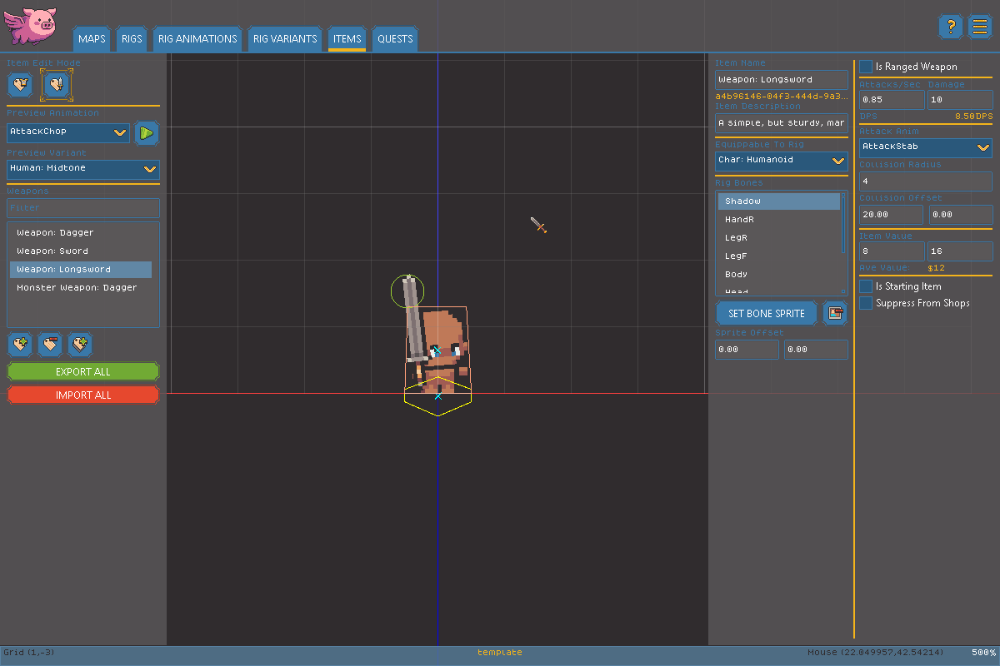

# Item Editor

The Item Editor is where you create the Weapons and Armor that Entities can wear and wield. See the [Glossary](glossary.md) for a refresher on Items - AirPig currently supports two Item types, edited from the **Armor** and **Weapon** tabs on the left side of this page.


Variants and Items Deep Dive



Armor isn't limited to actual armor! Since it can be attached to any Bone with any sprite, it's also how you create hair, clothing, and other cosmetic attachments - see the examples on the [engine overview page](./).


### Managing Items

<figure><figcaption></figcaption></figure>

Each tab has its own filterable list of Items:

* Type in the filter box to narrow the list by name.
* **New** creates a blank Item of the active tab's type.
* **Duplicate** copies the currently selected Item, including its bone attachments.
* **Delete** permanently removes the currently selected Item.


**Export** and **Import** let you bulk-edit every Item at once as a spreadsheet. Export writes all Armor and Weapon data to `items.csv` in your project's root folder; edit it in any spreadsheet program, then Import to overwrite your project's Items from that file. Rows with a blank ID are treated as brand new Items and given a new unique ID on import.


### Shared Item Fields

These fields apply to both Armor and Weapons:

* **Name** and **Description**.
* **Attach Rig** - which Rig this Item can be equipped onto.
* **Bone list** - once a Rig is selected, pick a Bone here to attach a sprite to it. Use the sprite button to choose an image for that Bone, or the clear button to remove it. **Sprite Offset (X/Y)** nudges the attached sprite into place relative to the Bone.
* **Min Value / Max Value** - the price range a store may charge for this Item; AirPig picks a price within this range per-store. The average of the two is shown for reference.
* **Is Starting Item** - when checked, this Item is automatically granted and equipped to the player at the start of a new game.
* **Suppress From Shops** - when checked, this Item is excluded from stores' randomized stock (handy for quest rewards or unique drops). This doesn't stop you from placing it manually in any inventory, store or not.

### Armor Fields

* **Defense** - added to the wearer's total defense.
* **Speed Penalty** - added to the wearer's move speed (use a negative value to slow the wearer down, or a positive value to speed them up).

### Weapon Fields

* **Attacks Per Second** and **Damage** - together these drive the displayed **DPS** (damage per second) estimate.
* **Attack Animation** - which Animation from the equipped Rig plays when this Weapon attacks. The play button next to it previews the animation.
* **Collision Radius** and **Collision Offset (X/Y)** - the melee hit circle's size and position, relative to the Rig's flagged weapon Bone.
* **Is Ranged** - check this to turn the Weapon into a ranged weapon, which reveals additional fields:
  * **Projectile Speed** and **Max Distance** - how fast the projectile travels and how far it can go before disappearing.
  * **Creation Offset (X/Y)** - where the projectile spawns, relative to the weapon bone.
  * **Projectile Sprite** and **Projectile Shadow** - set (or clear) the images used for the projectile itself and its ground shadow.

### Previewing

Once a Rig is selected, use the **Variant** dropdown to preview the Item on a different Variant's sprites without changing your project's actual settings.
