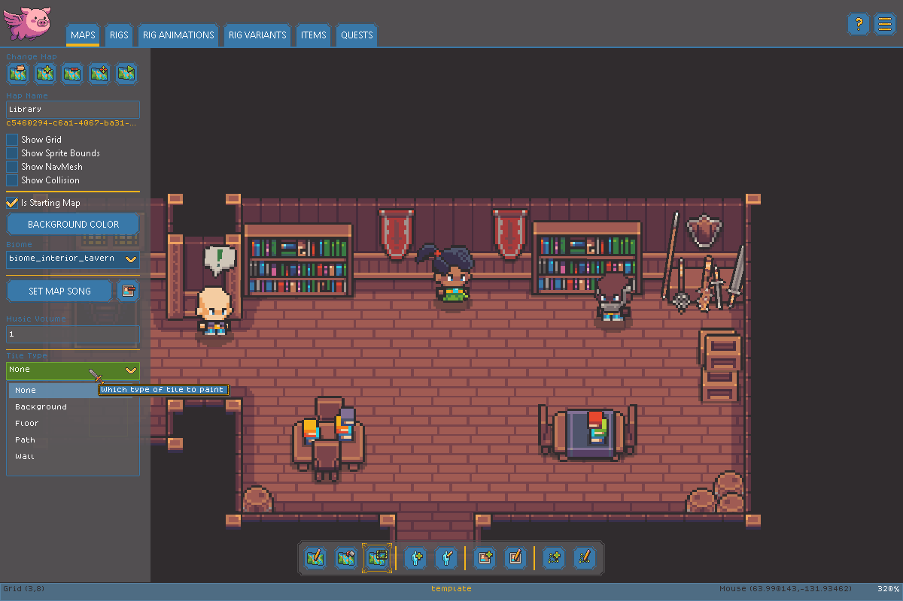
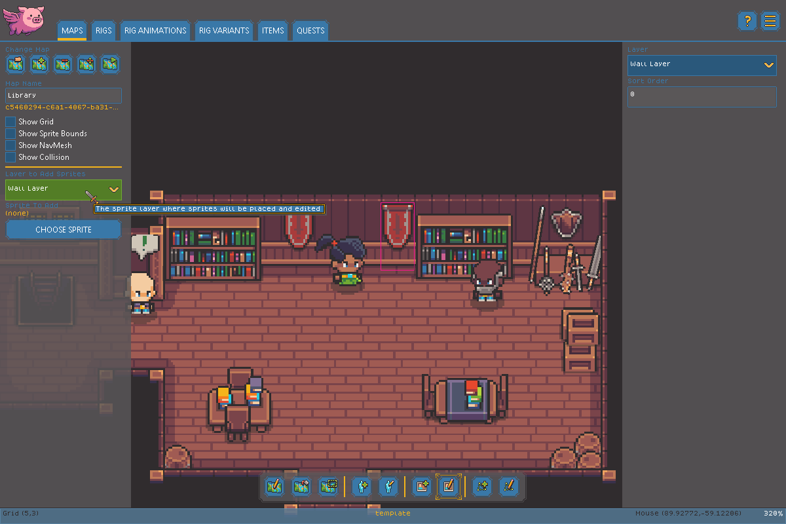
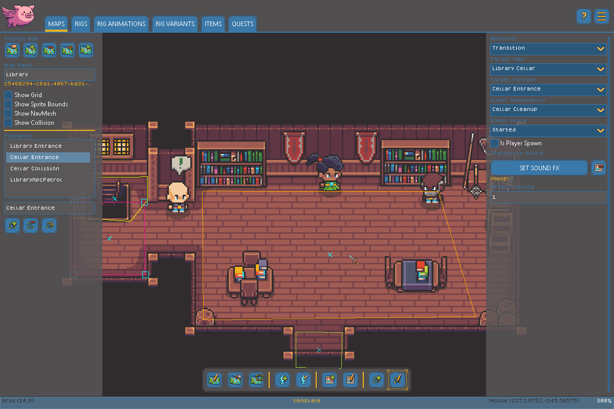

# Map Editor

The Map Editor is where everything comes together - drawing out a level's geometry and populating it with Entities, sprites, and Polygons. See the [Glossary](glossary.md) for a refresher on Maps, Layers, Tiles, and Polygons.

The Map Editor constantly saves your map file as changes are made so you do not have to worry about saving your settings. We strongly recommend becoming familiar with a [Version Control System tool such as GitHub Desktop](https://www.youtube.com/watch?v=8Dd7KRpKeaE) so you can regularly save changes to game as you work on it!


Want a video instead? Check out our [Map Editor Deep Dive](https://youtu.be/P69CJ60ZkaQ?si=iwFBqPe3LrUQxisv) video on Youtube!


### Managing Maps

<figure><figcaption></figcaption></figure>

* **Open** icon loads an existing Map from your project.
* **Create** icon starts a brand new Map.
* **Resize** icon changes the current Map's dimensions.
* **Delete** icon permanently removes the current Map from your project.

### Map Settings

* **Map Name** - the name of the map. Renaming a map will not break the game because maps and transitions between maps use the automatically-generated ID (shown below the map but not changeable)
* **Show Grid**, **Show Collision**, **Show Sprite Bounds**, **Show Nav Mesh** - overlay toggles that only affect what you see while editing; they don't change the published game.
* **IsStartingMap** - marks the map as the one a new game begins on. Only one map can be the starting map.
* **Background Color** - the color shown behind everything else on the Map.
* **Biome** - the tileset used to draw this Map. See [Creating Raw Content](creating-raw-content.md#biomes) for how Biomes work.
* **Set/Clear Map Song** - Buttons that allow you to set or clear the song played on this map.
* **Music Volume** - Allows you to adjust the music volume to balance sound volume across maps. The value should be 0 (silent) to 1 (full volume).
* **Song** - the background music that plays on this Map. Use the set button to choose a track, or the clear button to remove it, and **Music Volume** to adjust its playback level.

### Painting Tiles

Choose a **Layer** (Background, Floor, Path, Wall, or Wall Tops) from the layer dropdown, then use one of the tile tools to paint it:

<figure><figcaption></figcaption></figure>

* **Pencil** paints one tile at a time.
* **Fill** paints every connected tile of the same type.
* **Rectangle** paints a rectangular area at once.

### Placing Entities

<figure><figcaption></figcaption></figure>

Use the entity list on the left, optionally narrowed with the filter box, to pick which Rig you want to place, then use the **Add Entity** tool to place instances of it on the Map. The **Edit Entity** tool lets you select and reposition instances already on the Map.

<figure><figcaption></figcaption></figure>

### Placing Sprites

<figure><figcaption></figcaption></figure>

Choose a sprite with the sprite chooser button, then use **Add Sprite** to place copies of it on the Map. **Edit Sprite** lets you select and reposition sprites already placed.

* **Placement Layer** decides which layer new sprites are added to, and filters which existing sprites the Edit tool can select.
* For layers that support manual stacking order, **Sort Layer** controls which sprites draw in front of others. This is disabled for the Entity layer, which is always sorted automatically by vertical position instead.

### Working with Polygons

<figure><figcaption></figcaption></figure>

Use **Add Polygon** to draw a new Polygon, and **Edit Polygon** to select and reshape an existing one by dragging its Nodes. See the [Glossary](glossary.md) for what a Polygon and its Nodes are.

Once a Polygon is selected, choose its **Behavior**:

* **None** - no special behavior; the shape is purely informational.
* **Collide** - acts as solid collision, blocking movement.
* **Transition** - moves the player to another Map when they enter. Set the **Target Map**, the **Target** Polygon in that map to arrive at, an optional **Quest** that must be completed first, and whether this is the **Player Spawn** location used by default.
* **Spawn** - periodically spawns creatures. Set the **Spawn Rig** and **Spawn Variant** to create, how many spawn before the player encounters them (**Pre-Spawn**), and caps on **Active Creatures** and **Total Creatures**. Use the **Equipped** list to give spawned creatures starting equipment.
* **Patrol Area** - an area that can be set as an NPCs patrol area, causing them to walk around randomly within the area.

### Playtesting

The **Play** button launches the current Map for a quick in-editor playtest.
