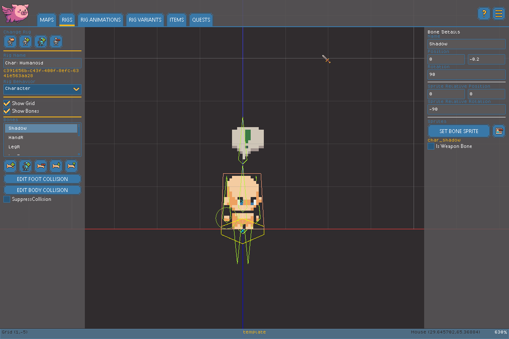

# Rig Editor

The Rig Editor is where you build the skeleton behind every Entity in your game - positioning Bones, attaching sprites to them, and deciding how the Entity behaves. See the [Glossary](glossary.md) for a refresher on Rigs, Bones, and Entities if you're new to skeletal animation.


Want a guided walkthrough instead? Check out our [Rig Deep Dive video on YouTube](https://youtu.be/kfay8D5D120?si=wKM2vMmgu4ZDsAqI).


### Creating and Managing Rigs

<figure><figcaption></figcaption></figure>

At the top of the Rig Editor you'll find the tools for managing which Rig you're working on:

* **Open** loads an existing Rig from your project.
* **Add** creates a brand new, empty Rig.
* **Clone** makes a full copy of the currently loaded Rig, complete with a new unique ID, so you can branch off an existing skeleton without affecting the original.
* **Delete** permanently removes the currently loaded Rig from your project. You'll be asked to confirm first, and this can't be undone.


Screenshot needed: the Rig Editor's rig management buttons and name field.


Once a Rig is loaded, you can rename it directly in the name field.

### Setting a Rig's Behavior

Every Rig has a **Behavior**, chosen from the Behavior dropdown, that determines how Entities using this Rig act in the game:

* **Character**: The most capable behavior. Characters can pathfind, carry equipment, attack, and be controlled by AI or a player.
* **Container**: A simple entity with an inventory that can be opened to exchange items.
* **Prop**: A simple entity with just a collision footprint, which may optionally be destroyable.

Changing a Rig's Behavior automatically creates any Animations that behavior requires (for example, Characters require animations like `Moving`, `AttackUnarmed`, and `Dying`) if they don't already exist. You can delete auto-created animations you don't need, but you'll want to make sure nothing else depends on them first.

### Working with Bones

The Bone list shows every Bone in the current Rig. From here you can:

* **Add** a new Bone to the Rig.
* **Duplicate** the selected Bone.
* **Delete** the selected Bone (with a confirmation prompt).
* **Move Up / Move Down** to reorder Bones in the list.

Selecting a Bone from the list opens its properties for editing:

* **Name** - a friendly label for the Bone.
* **Position (X/Y)** and **Rotation** - where the Bone sits and how it's angled relative to its parent.
* **Sprite** - use the button to choose the image attached to this Bone, or the clear button to remove it. The Sprite's own offset (X/Y) and rotation can be fine-tuned independently of the Bone itself, so you can nudge artwork into place without moving the Bone.
* **Is Weapon Bone** - flags this Bone as the attachment point for melee/unarmed attack collision. Only one Bone per Rig should typically be flagged this way.

Two checkboxes above the Bone Viewer, **Show Grid** and **Show Bones**, toggle helpful overlays while you work but don't affect the game itself.

### Editing Collision

Two buttons let you edit the Rig's collision shapes directly on the canvas:

* **Edit Footprint Collision** opens editing for the Rig's Footprint Collision - the shape that determines how much space the Entity takes up and blocks other objects from moving through it.
* **Edit Body Collision** opens editing for the Rig's Body Collision - the shape used to determine what's clickable when placing the Entity on a map, and where it can be hit to take damage during gameplay.

See the [Glossary](glossary.md) for more on the difference between Footprint and Body Collision. Selecting either collision editing mode deselects any currently selected Bone.
