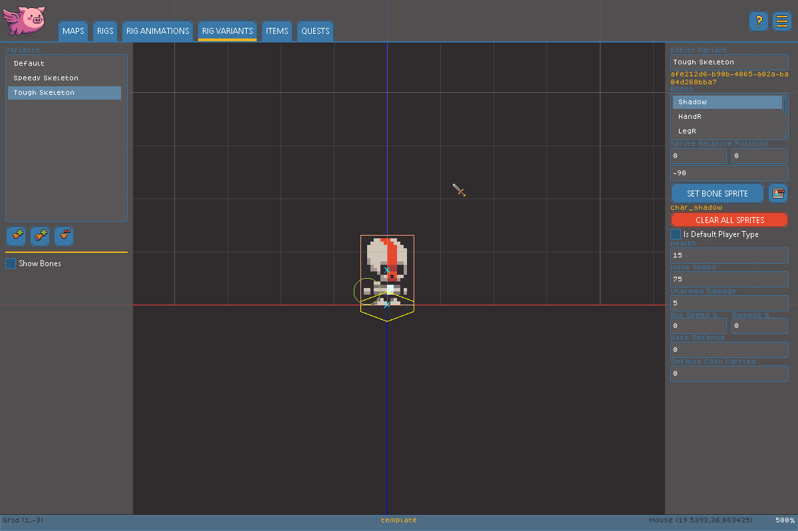

# Variant Editor

The Variant Editor lets you take a single Rig and turn it into a whole cast of characters, containers, or props - reskinning its Bones with different sprites and tuning its stats, without touching the underlying skeleton or Animations. See the [Glossary](glossary.md) for a refresher on Variants if you're new to the concept, and check out the "Darktone" and "Skele:Bruiser" examples on the [engine overview page](./) for a sense of what Variants make possible.


Variant Deep Dive


### Managing Variants

<figure><figcaption></figcaption></figure>

The Variant list shows every Variant defined on the current Rig. From here you can:

* **Add** a new Variant.
* **Duplicate** the selected Variant, including all of its bone overrides and stats.
* **Delete** the selected Variant, with a confirmation prompt. The Rig's **Default** Variant can't be deleted - every Rig must always have at least one Variant to fall back on.

### Variant Identity

With a Variant selected, you can set its **Name**. **Is Default Player Character** marks this specific Rig + Variant combination as the one a new game starts the player as - checking it on one Variant automatically unchecks it everywhere else in your project.

### Re-skinning Bones

Selecting a Bone from the bone list on this page lets you override how that Bone looks _for this Variant only_, without affecting other Variants that share the same Rig:

* Use the sprite button to choose a replacement sprite for the selected Bone, or the clear button to remove just this Bone's override.
* **Sprite Offset (X/Y)** and **Sprite Rotation** let you nudge the replacement sprite into place, independently of the Bone's own position.
* **Clear All Sprites** removes every sprite override on the current Variant at once, resetting it back to the Rig's base look.

**Show Bones** toggles a bone overlay while you work; it doesn't affect the published game.

### Stats

The stat fields shown depend on the Rig's Behavior (see [Rig Editor](rig-editor.md)):

**Character stats:**

* **Health** - how much health this Variant has.
* **Move Speed** - base movement speed in world units per second. Any equipped Armor's speed modifiers are added on top of this.
* **Attack Speed** - an offset applied to weapon attack speed: 0 means no change, -0.2 is 20% slower, +0.2 is 20% faster.
* **Damage Multiplier** - an offset applied to weapon damage: 0 means no change, -0.1 is 10% less damage, and so on.
* **Defense** - a flat defense value added to whatever's contributed by equipped Armor, subtracted from incoming damage (up to the engine's damage resistance cap).
* **Unarmed Damage** - damage dealt when this Variant attacks with no Weapon equipped.

**Container stats:**

* **Item Type** - the category of Item this container holds.
* **Item Quantity** - how many Items the container produces when opened.
* **Storage Quantity** - how many Item storage slots the container provides.
* **Default Cash** - starting currency granted to entities using this Variant. Spawned creatures use this value as-is; individually placed instances can override it.
